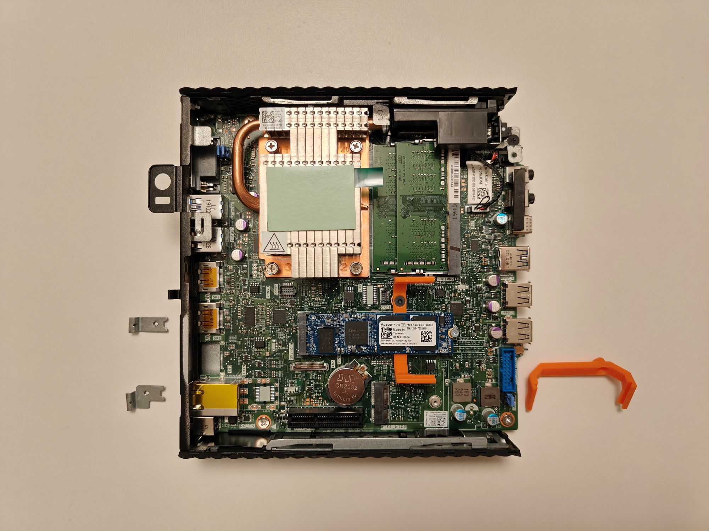
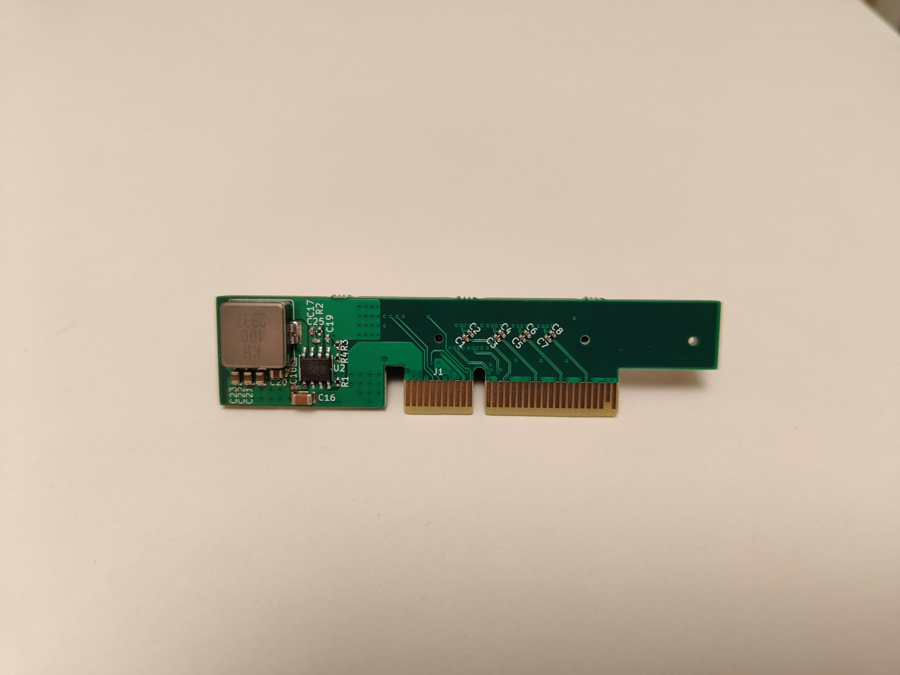
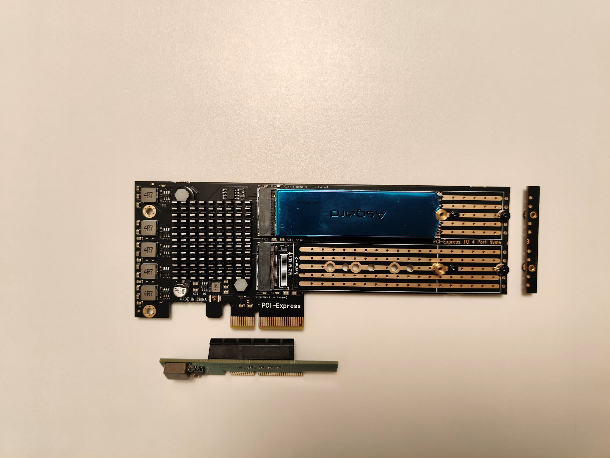
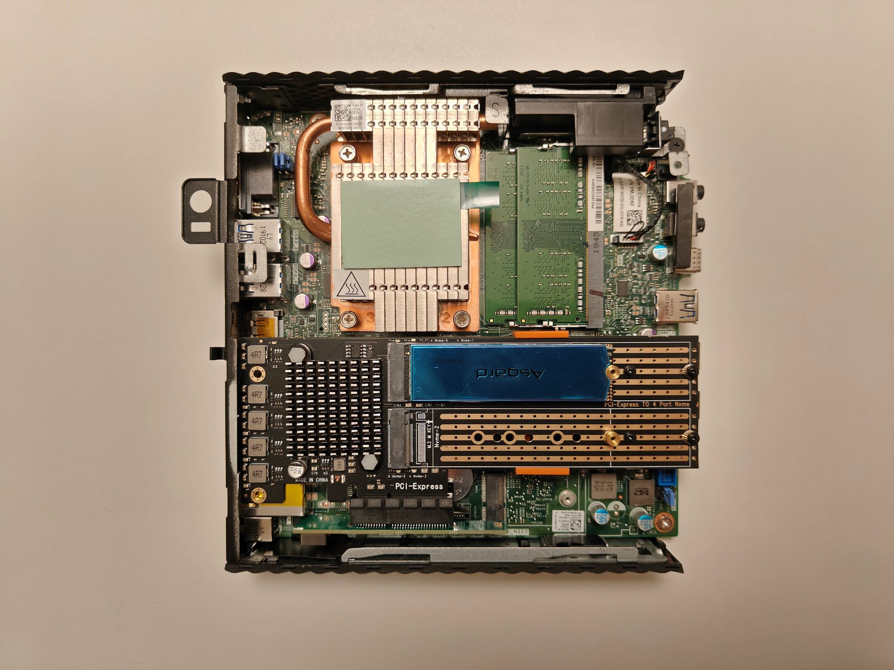

# WYSE_5070_All_Flash_NAS

最近买了个二手的WYSE 5070瘦客户机打算用作低功耗NAS。由于不是Extended版本，需要对硬件进行改动来安装额外的硬盘。

之前看了[KCORES的教程](https://youtu.be/9opQ4gsh4Hg?si=m19QCSclOVte6yVY)，给主板加了PCIE插槽但是配套的Riser卡放不进机箱，而且需要搭配12V电源。

于是一切为了美观，设计了一个自带19V转12V的矮版转接卡，配合PCIE桥接卡可以拓展4个M.2 NVME SSD。配合机箱内部预留的螺丝孔位，正好可以3D打印个支架用来固定扩展卡。

## 硬件改动

1. 需要切掉原本用来固定背板扩展卡的两个金属片。以及将3D打印的NVME扩展卡支架用M3x10螺丝安装到机箱内。

2. 需要将NVME扩展卡末端切掉5mm，否则机箱盖子盖不上。（这里用的是SSU SU-EM5204(A3)版的扩展卡，链接就不放了，某宝有卖。）没用更高速的版本是因为散热器高度的问题，这里我把原本10mm的散热片剪成了6mm高度，正好能放下。如果能找到合适的散热片，推荐买高速版本，因为5204-A3上行是3.0x2而主板是2.0x4，浪费了很多。机箱外壳是金属的，可以加散热贴通过机箱散热。

## 安装注意

1. 安装扩展卡的时候，要先把NVME扩展卡插入Riser卡里再一起插入主板PCIE插槽，否则没法装扩展卡。

2. 如果是和我一样用的无EMMC版本的，需要先安装扩展卡支架再安装主板上的SATA SSD。

## 示意图

